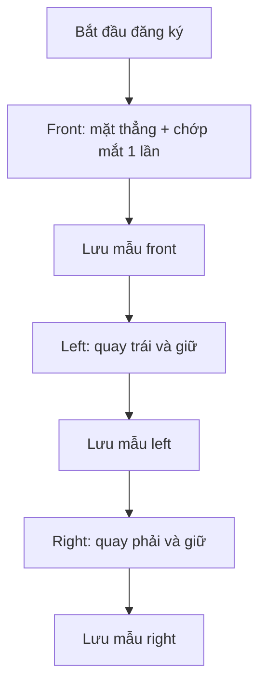
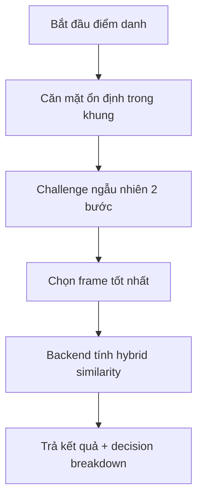

# Hệ Thống Điểm Danh Khuôn Mặt

Ứng dụng web điểm danh sinh viên bằng khuôn mặt, gồm frontend React và backend FastAPI. Phiên bản hiện tại tập trung vào:

- Đăng ký 3 mẫu khuôn mặt `front / left / right`
- Điểm danh bằng challenge ngẫu nhiên nhiều bước
- Chọn frame tốt nhất ở frontend
- Tính `hybrid similarity` ở backend bằng InsightFace

Báo cáo kỹ thuật chi tiết nằm tại [REPORT_VI.md](/D:/Python/project/ATTENDANCE-VERIFICATION/ATTENDANCE-VERIFICATION-SYSTEM/REPORT_VI.md).

## Kiến trúc hiện tại

```mermaid
flowchart LR
    A["Camera trình duyệt"] --> B["MediaPipe Face Mesh"]
    B --> C["Kiểm tra căn giữa / pose / chớp mắt / mở miệng"]
    C --> D["Lấy burst frame sau khi đã ổn định"]
    D --> E["Chấm quality và chọn frame tốt nhất"]
    E --> F["Gửi 1 frame + capture_meta lên backend"]
    F --> G["InsightFace sinh embedding"]
    G --> H["Hybrid similarity: best sample + top-k + centroid"]
    H --> I["Ghi attendance_logs và trả kết quả"]
```



## Luồng nghiệp vụ

### Đăng ký khuôn mặt



### Điểm danh



## Cấu hình threshold

### Frontend

Toàn bộ threshold phía frontend đã được gom vào một bảng cấu hình duy nhất:

- [constants.js](/D:/Python/project/ATTENDANCE-VERIFICATION/ATTENDANCE-VERIFICATION-SYSTEM/frontend/src/liveness/constants.js)

Cấu trúc chính:

- `THRESHOLDS.session`
- `THRESHOLDS.blink`
- `THRESHOLDS.alignment`
- `THRESHOLDS.pose`
- `THRESHOLDS.quality`
- `THRESHOLDS.antiReplay`

Ngoài ra, tham số lấy mẫu frame nằm trong:

- `FRAME_CONFIG.sampleSize`
- `FRAME_CONFIG.maxBufferedFrames`
- `FRAME_CONFIG.sampleEveryNFrames`

### Backend

Ngưỡng quyết định similarity nằm trong:

- [.env.example](/D:/Python/project/ATTENDANCE-VERIFICATION/ATTENDANCE-VERIFICATION-SYSTEM/.env.example)
- [config.py](/D:/Python/project/ATTENDANCE-VERIFICATION/ATTENDANCE-VERIFICATION-SYSTEM/backend/app/config.py)

Biến đang dùng:

```env
SIMILARITY_THRESHOLD=0.72
```

## Cách cập nhật threshold

1. Nếu đổi threshold frontend, sửa [constants.js](/D:/Python/project/ATTENDANCE-VERIFICATION/ATTENDANCE-VERIFICATION-SYSTEM/frontend/src/liveness/constants.js).
2. Nếu đổi threshold backend, sửa [.env](/D:/Python/project/ATTENDANCE-VERIFICATION/ATTENDANCE-VERIFICATION-SYSTEM/.env) hoặc [.env.example](/D:/Python/project/ATTENDANCE-VERIFICATION/ATTENDANCE-VERIFICATION-SYSTEM/.env.example).
3. Sau khi sửa:

```powershell
cd frontend
npm run build
```

```powershell
.\.venv\Scripts\python -m uvicorn backend.app.main:app --host 127.0.0.1 --port 8000
```

4. Kiểm tra backend runtime thật sự:

- [http://127.0.0.1:8000/api/runtime-config](http://127.0.0.1:8000/api/runtime-config)
- [http://127.0.0.1:8000/api/health](http://127.0.0.1:8000/api/health)

## Hybrid similarity

Backend hiện dùng công thức:

```text
centroid_score = cosine(probe, centroid)
best_sample_score = max(sample_scores)
top_k_score = mean(top 2 sample_scores)
pose_weighted_score = 0.7 * top_k_score + 0.3 * centroid_score
raw_match_score = max(best_sample_score, pose_weighted_score)
quality_margin = bonus nhỏ theo chênh lệch blur / brightness
final_score = min(0.99, raw_match_score + quality_margin)
```

Khi điểm danh, frontend cũng hiển thị:

- `Threshold backend runtime`
- `Điểm hybrid similarity`
- `Raw match score`
- `Quality margin`

## API chính

- `POST /api/profile/upsert`
- `GET /api/profile/{student_id}`
- `POST /api/face/register`
- `POST /api/attendance/verify`
- `GET /api/runtime-config`
- `GET /api/health`

## Trạng thái anti-replay

Module anti-replay heuristic vẫn còn trong mã nguồn để nghiên cứu tiếp, nhưng hiện tại:

- Không dùng để fail phiên
- Không hiển thị trên giao diện debug
- Không còn giao diện legacy riêng

## Chạy local

### Backend

```powershell
.\.venv\Scripts\python -m uvicorn backend.app.main:app --host 127.0.0.1 --port 8000
```

### Frontend

```powershell
cd frontend
npm install
npm run dev
```

### PostgreSQL

```powershell
docker compose up -d
```

## Kiểm thử

Frontend:

```powershell
cd frontend
npm test -- --run
npm run build
```

Backend:

```powershell
python -m unittest discover -s tests
```

## Cấu trúc đáng chú ý

- [CameraSession.jsx](/D:/Python/project/ATTENDANCE-VERIFICATION/ATTENDANCE-VERIFICATION-SYSTEM/frontend/src/components/CameraSession.jsx)
- [constants.js](/D:/Python/project/ATTENDANCE-VERIFICATION/ATTENDANCE-VERIFICATION-SYSTEM/frontend/src/liveness/constants.js)
- [challengeEngine.js](/D:/Python/project/ATTENDANCE-VERIFICATION/ATTENDANCE-VERIFICATION-SYSTEM/frontend/src/liveness/challengeEngine.js)
- [quality.js](/D:/Python/project/ATTENDANCE-VERIFICATION/ATTENDANCE-VERIFICATION-SYSTEM/frontend/src/liveness/quality.js)
- [attendance.py](/D:/Python/project/ATTENDANCE-VERIFICATION/ATTENDANCE-VERIFICATION-SYSTEM/backend/app/services/attendance.py)
- [routes.py](/D:/Python/project/ATTENDANCE-VERIFICATION/ATTENDANCE-VERIFICATION-SYSTEM/backend/app/api/routes.py)
