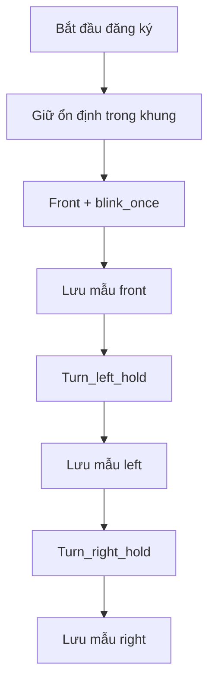
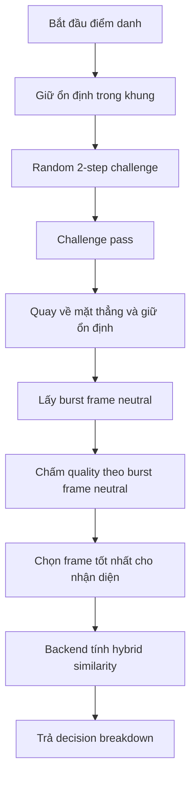

# Báo Cáo Kỹ Thuật

## 1. Mục tiêu hiện tại

Phiên bản hiện tại của dự án tập trung vào một lõi nhận diện mặt đủ gọn để tích hợp về sau:

- Frontend xử lý camera, landmark, challenge và chọn frame tốt nhất
- Backend chỉ tập trung vào embedding, so khớp và ghi log
- Chống giả mạo heuristic vẫn còn trong code nhưng đang tắt khỏi luồng quyết định chính

Mục tiêu của đợt làm sạch này là:

- Gom toàn bộ threshold về cấu hình tập trung
- Dọn giao diện debug để dễ quan sát
- Loại bỏ phần legacy không còn dùng
- Đồng bộ tài liệu với đúng trạng thái runtime hiện tại

## 2. Phân tách trách nhiệm

Frontend:

- Mở camera
- Lấy landmark bằng MediaPipe
- Điều khiển challenge
- Chấm chất lượng frame
- Chọn một frame tốt nhất để gửi lên backend

Backend:

- Giải mã ảnh
- Trích embedding bằng InsightFace
- Tính điểm `hybrid similarity`
- Trả `decision_breakdown`
- Ghi lịch sử vào `attendance_logs`

## 3. Tổ chức cấu hình threshold

Toàn bộ threshold phía frontend đã được gom tại:

- [frontend/src/liveness/constants.js](/D:/Python/project/ATTENDANCE-VERIFICATION/ATTENDANCE-VERIFICATION-SYSTEM/frontend/src/liveness/constants.js)

### 3.1 Cấu trúc mới

```javascript
THRESHOLDS = {
  session: { ... },
  blink: { ... },
  alignment: { ... },
  pose: { ... },
  quality: { ... },
  antiReplay: { ... }
}
```

Ngoài ra:

```javascript
FRAME_CONFIG = {
  sampleSize,
  maxBufferedFrames,
  sampleEveryNFrames
}
```

### 3.2 Ý nghĩa các nhóm threshold

`THRESHOLDS.session`

- `alignmentHoldMs`: thời gian giữ ổn định trước khi challenge bắt đầu
- `poseHoldMs`: thời gian giữ tư thế ở các challenge quay trái / quay phải / mở miệng
- `verifyStepTimeoutMs`: timeout cho từng bước điểm danh
- `verifySessionTimeoutMs`: timeout toàn phiên điểm danh
- `verifyNeutralCaptureHoldMs`: thời gian giữ mặt thẳng sau challenge để chụp ảnh recognition
- `verifyNeutralCaptureTimeoutMs`: timeout cho pha neutral capture sau challenge
- `registerSessionTimeoutMs`: timeout toàn phiên đăng ký

`THRESHOLDS.blink`

- `minBaselineEar`
- `closeFloorEar`
- `recoverFloorEar`
- `minBlinkFrames`
- `maxBlinkFrames`

`THRESHOLDS.alignment`

- `strictCenterX`
- `strictCenterY`
- `turnCenterX`
- `turnCenterY`
- `wrongTurnYaw`
- `frontYawMax`
- `rollMax`
- `pitchMax`
- `faceSizeMinRatio`
- `faceSizeMaxRatio`

`THRESHOLDS.pose`

- `leftYawMin`
- `rightYawMin`
- `mouthOpenRatioMin`

`THRESHOLDS.quality`

- `blurMin`
- `brightnessMin`
- `brightnessMax`
- `qualityMin`

`THRESHOLDS.antiReplay`

- `enabled`
- `motionCorrMax`
- `flickerPeakMax`
- `stripeScoreMax`
- `moireScoreMax`

## 4. Luồng đăng ký



Sau mỗi pose:

- Frontend lấy burst frame
- Chấm quality
- Chọn frame tốt nhất
- Gửi duy nhất 1 frame lên backend

## 5. Luồng điểm danh



Challenge verify hiện dùng tập:

- `blink_twice`
- `turn_left_hold`
- `turn_right_hold`
- `open_mouth`

## 6. Công thức chính

### 6.1 Blink bằng EAR

```text
EAR = (||p2-p6|| + ||p3-p5||) / (2 * ||p1-p4||)
```

EAR dùng để phát hiện:

- `blink_once`
- `blink_twice`

### 6.2 Pose

```text
roll  = atan2(dy_eye, dx_eye)
yaw   = atan(((x_nose - x_eye_mid) / eye_span) * k_yaw)
pitch = atan(((y_nose - y_face_mid) / face_height) * k_pitch)
```

### 6.3 Mở miệng

```text
mouth_open_ratio = distance(upper_lip, lower_lip) / distance(mouth_left, mouth_right)
```

### 6.4 Quality

```text
blur_score = Var(Laplacian(gray_face_roi))
brightness_mean = mean(Y)
Y = 0.299R + 0.587G + 0.114B
```

### 6.5 Hybrid similarity

```text
centroid_score = cosine(probe, centroid)
best_sample_score = max(sample_scores)
top_k_score = mean(top 2 sample_scores)
pose_weighted_score = 0.7 * top_k_score + 0.3 * centroid_score
raw_match_score = max(best_sample_score, pose_weighted_score)
final_score = min(0.99, raw_match_score)
```

`capture_meta.quality` vẫn được backend lưu trong log để phục vụ debug và phân tích, nhưng không còn tham gia cộng hoặc trừ vào `final_score`.

Điểm quan trọng của luồng mới là frame gửi sang backend trong `verify` không còn lấy trực tiếp từ lúc người dùng đang blink, mở miệng hoặc quay đầu. Challenge chỉ dùng để xác nhận liveness; sau khi challenge pass, frontend buộc người dùng quay lại tư thế trung tính rồi mới chụp burst frame riêng cho recognition.

Backend chỉ pass khi:

- đủ 3 mẫu đăng ký
- `final_score >= SIMILARITY_THRESHOLD`

## 7. Cách xem threshold runtime thật sự

Đây là phần đã được làm lại để tránh nhầm lẫn giữa file cấu hình và process runtime.

Kiểm tra bằng:

- [http://127.0.0.1:8000/api/runtime-config](http://127.0.0.1:8000/api/runtime-config)
- [http://127.0.0.1:8000/api/health](http://127.0.0.1:8000/api/health)

Frontend cũng hiển thị:

- `Threshold backend runtime`
- `Điểm hybrid similarity`
- `Raw match score`

## 7.1 Cấu hình môi trường khi chạy dev

Dự án chỉ cần file `.env` ở root cho cấu hình backend runtime. Frontend không cần `frontend/.env` cho luồng dev local hoặc VS Code dev tunnel.

Frontend gọi API bằng đường dẫn relative `/api/...`. Trong môi trường dev, [frontend/vite.config.js](/D:/Python/project/ATTENDANCE-VERIFICATION/ATTENDANCE-VERIFICATION-SYSTEM/frontend/vite.config.js) proxy toàn bộ `/api` sang backend local `http://127.0.0.1:8000`.

Khi test trên điện thoại bằng VS Code forward port:

- Chạy backend ở `127.0.0.1:8000`
- Chạy frontend ở `5173`
- Forward port `5173`
- Mở URL tunnel của frontend trên điện thoại

Không cần hard-code URL tunnel backend và không cần tạo `frontend/.env` riêng.

## 8. Làm sạch giao diện

### 8.1 Đã loại bỏ

- Dòng `Frames sampled`
- Các debug anti-replay không còn dùng ở runtime
- Hai dòng telemetry phụ về lấy mẫu frame

### 8.2 Còn giữ lại

- Bước challenge hiện tại
- Trạng thái căn giữa
- Kích thước khuôn mặt
- Pose
- EAR / Blink
- Mouth open khi cần
- Blur / Brightness / Quality

Mục tiêu là để debug panel vẫn đủ thông tin tuning nhưng không gây rối mắt.

## 9. Làm sạch mã nguồn

Các thay đổi làm sạch đáng chú ý:

- Gom threshold về `THRESHOLDS` và `FRAME_CONFIG`
- Viết lại `CameraSession.jsx` theo cấu trúc gọn hơn
- Loại bỏ giao diện legacy trong thư mục `static/`
- Xóa log tạm ở thư mục gốc
- Cập nhật `.gitignore`

## 10. Trạng thái anti-replay

Anti-replay heuristic:

- vẫn còn module để nghiên cứu tiếp
- hiện `enabled = false`
- không tham gia quyết định pass/fail
- không hiển thị trên giao diện debug

Điều này giúp hệ thống:

- dễ tune hơn
- giảm false reject
- giảm rối khi đánh giá similarity

## 11. Kiểm thử đã chạy

Frontend:

```powershell
cd frontend
npm test -- --run
npm run build
```

Backend:

```powershell
python -m unittest discover -s tests
```

Kết quả tại thời điểm cập nhật:

- Frontend test pass
- Frontend build pass
- Backend unittest pass

## 12. Cách chỉnh threshold về sau

### Frontend

Sửa trực tiếp tại:

- [frontend/src/liveness/constants.js](/D:/Python/project/ATTENDANCE-VERIFICATION/ATTENDANCE-VERIFICATION-SYSTEM/frontend/src/liveness/constants.js)

Sau đó:

```powershell
cd frontend
npm run build
```

hoặc nếu đang chạy dev server:

```powershell
npm run dev
```

Frontend dev server tự proxy `/api` sang backend local, nên không cần sửa `VITE_API_BASE_URL` khi chạy local hoặc khi test qua VS Code dev tunnel.

### Backend

Sửa threshold runtime tại:

- [.env](/D:/Python/project/ATTENDANCE-VERIFICATION/ATTENDANCE-VERIFICATION-SYSTEM/.env)

File [backend/app/config.py](/D:/Python/project/ATTENDANCE-VERIFICATION/ATTENDANCE-VERIFICATION-SYSTEM/backend/app/config.py) chỉ giữ giá trị mặc định khi không có `.env`.

Sau khi sửa `.env`, backend phải được restart vì cấu hình được đọc khi process khởi động. Nếu port `8000` đang bị process cũ giữ, dừng process đó trước:

```powershell
Get-NetTCPConnection -LocalPort 8000 -State Listen | ForEach-Object { Stop-Process -Id $_.OwningProcess -Force }
.\.venv\Scripts\python -m uvicorn backend.app.main:app --host 127.0.0.1 --port 8000
```

Kiểm tra runtime thật sự:

```powershell
Invoke-RestMethod http://127.0.0.1:8000/api/health
```

## 13. Kết luận

Trạng thái hiện tại của dự án đã rõ ràng hơn ở ba điểm:

- runtime threshold có thể kiểm tra trực tiếp
- cấu hình frontend đã tập trung về một chỗ
- giao diện và mã nguồn đã được dọn bớt phần legacy gây nhiễu

Đây là nền tốt để bước tiếp theo tập trung vào hiệu quả nhận diện thật sự thay vì mất thời gian truy vết cấu hình hay giao diện cũ.
